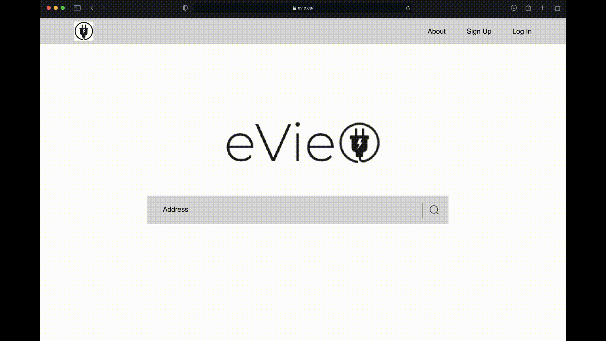

# Project 1 - eVie

## Description
This project was to use 2 server-side APIs to create a real-world front-end application. eVie is a web application to locate electric vehicle charging stations near the user and get more details on what the charging stations offers.

## User Story
AS A driver
I WANT to find EV charging stations
SO I can charge my vehicle

## Acceptance Criteria
GIVEN I am an electric vehicle driver looking for charging stations,
WHEN I open the app
THEN I will be directed to a landing page
WHEN I search a location on the app,
THEN I will be taken to that area on the map and  shown charging stations within the area                     
WHEN I select a charging station
THEN I will be shown information about that charging station

## Mock-Up vs. Project
Lorem ipsum dolor sit amet, consectetur adipiscing elit, sed do eiusmod tempor incididunt ut labore et dolore magna aliqua.

## API Reference
These APIs provide information to drivers of the nearest charging stations as well as the station details.

Map - Google Maps
https://developers.google.com/maps/documentation/directions

Charging Station - Developer Network
https://developer.nrel.gov/docs/transportation/alt-fuel-stations-v1/nearest/

## Usage
To access this project, you can click on the final URL or the gitHub URL through the repository. In the gitHub repository, you can clone the repository to access locally or click on Settings > Pages > Visit site.

eVie URL:
https://yerimechoi.github.io/Project_1/

github URL:
https://github.com/yerimechoi/Project_1

## Collaborators
Greg Griffith               @GregGriffith905
Jeena Vasudevan             @JeenaKozhimukkath
Joshua Ramkissoon           @JoshuaOrlandoR
Esther Choi                 @yerimechoi

## License
N/A